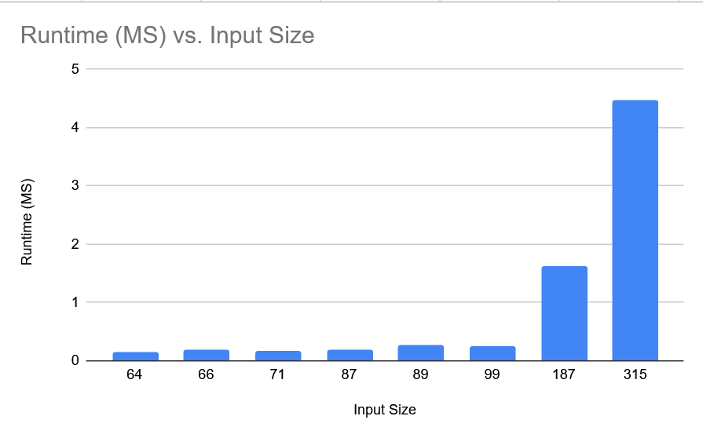

Dylan Coben - 64386159

Rohit Dasgupta - 23459981

## Instructions to run the program, including example commands
* run `py main.py` and input filename located inside data folder

# Q1 Table



# Q2

dp[i][j] represents the maximum total value of a common subsequence between the prefixes A[0..i - 1] and B[0..j - 1]

for the recurrence relation

dp[i][j] = 

dp[i-1][j-1] + v(A[i-1]) if A[i-i] = B[i-j] and 

max(dp[i-1][j], dp[i][j-1]) if A[i-1] =/= B[j-1]

Proof:

- If the last characters match, any optimal HVLCS for these prefixes can include that character, and the remaining best value is $dp[i-1][j-1]$.

- If they do not match, the optimal HVLCS must exclude one of them; the best value is the maximum of the two resulting subproblems.
- The base cases are correct because an empty string has no common subsequence with positive value.

# Q3 Big Oh

Pseudocode:

```text
HVLCS(A, B, v):
	n = |A|
	m = |B|
	dp = 2D array (n+1) x (m+1) filled with zeros

	for i <- 1 to n:
		for j <- 1 to m:
			if A[i-1] == B[j-1]:
				dp[i][j] <- dp[i-1][j-1] + v(A[i-1])
			else:
				dp[i][j] <- max(dp[i-1][j], dp[i][j-1])

	return dp[n][m]
```

let n, m be the size of A and B strings respectively

Runtime:

- Time complexity: $O(nm)$ due to filling the $n \times m$ table with an O(1) operation
- Space complexity: $O(nm)$ for the DP table.

